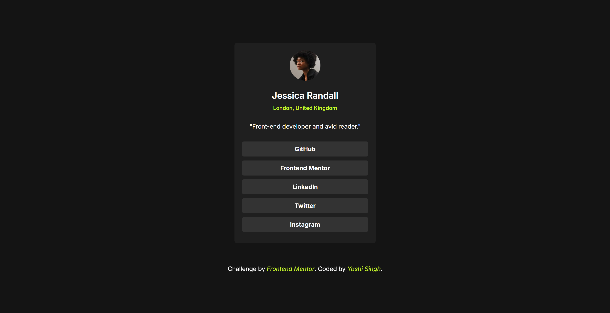
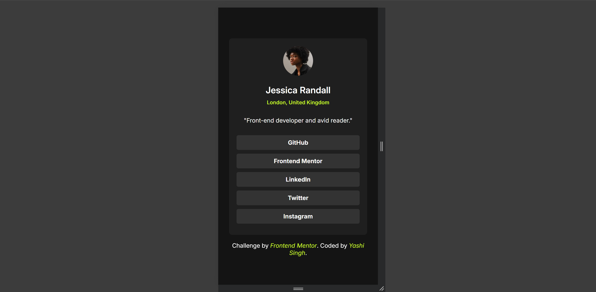

# Frontend Mentor - Social Links Profile Solution

This repository contains the solution for the [Social Links Profile](https://www.frontendmentor.io/challenges/social-links-profile-UG32l9m6dQ) challenge on Frontend Mentor. This project helps improve coding skills by working on realistic frontend tasks.

## Live Demo

Check out the live demo of the project: [Live Site](https://social-links-profile-by-yashi.netlify.app/)

## Links

- **LinkedIn Profile**: [Yashi Singh](https://www.linkedin.com/in/yashi-singh-b4143a246)

## Overview

### The Challenge

Users should be able to:

- See hover and focus states for all interactive elements on the page.

### Screenshots

- **Desktop Preview**

  

- **Mobile Preview**

  

## My Process

### Built With

- Semantic HTML5 markup
- CSS custom properties
- Flexbox
- Mobile-first workflow
- Google Fonts for font styling

### What I Learned

In this project, I learned to:

- Implement hover and focus states effectively for interactive elements.
- Use CSS custom properties to maintain a consistent color scheme.
- Adjust layouts responsively with media queries to ensure compatibility across various device sizes.

### Continued Development

I plan to continue improving:

- Responsiveness techniques to handle more diverse screen sizes.
- Performance optimization of CSS for better load times.
- Understanding of accessibility features in web design.

### Useful Resources

- [MDN Web Docs](https://developer.mozilla.org/) - Great for learning about HTML and CSS properties.
- [CSS-Tricks](https://css-tricks.com/) - Helpful articles and examples on CSS techniques.

## Author

- **Frontend Mentor**: [@Yashi-Singh-9](https://www.frontendmentor.io/profile/Yashi-Singh-9)
- **LinkedIn**: [Yashi Singh](https://www.linkedin.com/in/yashi-singh-b4143a246)

## Acknowledgments

A big thank you to the Frontend Mentor community for providing such engaging challenges and to my peers for their constructive feedback.
