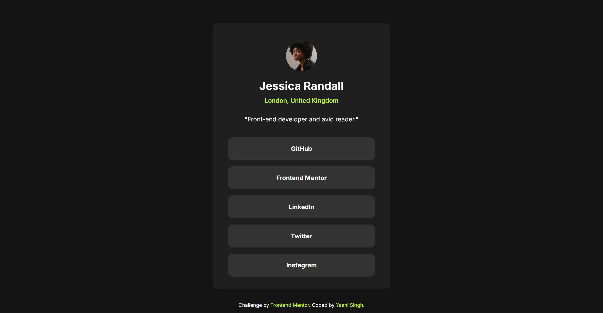
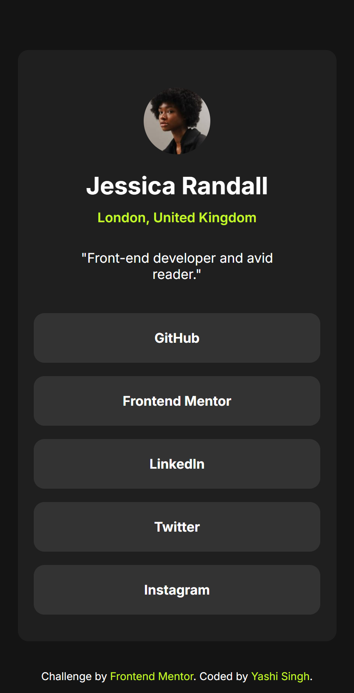

# Frontend Mentor - Social Links Profile Solution  
[](https://www.frontendmentor.io/challenges/social-links-profile-UG32l9m6dQ)  
[](https://social-links-profile-by-yashi.netlify.app/)  
[](https://www.linkedin.com/in/yashi-singh-b4143a246)  
[](https://github.com/Yashi-Singh-9/Social-Links-Profile)  

This repository contains the solution for the [Social Links Profile](https://www.frontendmentor.io/challenges/social-links-profile-UG32l9m6dQ) challenge on Frontend Mentor. This project helped me enhance my frontend development skills by working on realistic tasks.  

## Live Demo  

Check out the live demo of the project: [Live Site](https://yashi-singh-9.github.io/Social-Links-Profile/)  

## Links  

- **LinkedIn Profile**: [Yashi Singh](https://www.linkedin.com/in/yashi-singh-b4143a246)  

---

## Overview  

### The Challenge  

Users should be able to:  

- See hover and focus states for all interactive elements on the page.  

---

## Screenshots  

- **Desktop Preview**  

    

- **Mobile Preview**  

    

---

## My Process  

### Built With  

- Semantic HTML5 markup  
- SCSS for styling  
- CSS custom properties  
- Flexbox  
- Mobile-first workflow  
- Google Fonts for font styling  

---

### SCSS Installation and Usage  

To set up SCSS for this project, follow these steps:  

1. **Install Node.js and npm**:  
   Ensure you have Node.js and npm installed. You can download it [here](https://nodejs.org/).  

2. **Install SCSS**:  
   Run the following command to install Sass globally:  
   ```bash  
   npm install -g sass  
   ```  

3. **Compile SCSS to CSS**:  
   Use the following command to compile SCSS to CSS:  
   ```bash  
   sass scss/main.scss css/main.css --watch  
   ```  
   The `--watch` flag will automatically compile your SCSS file whenever changes are made.  

4. **Link CSS in HTML**:  
   Ensure the compiled CSS file is linked in your HTML:  
   ```html  
   <link rel="stylesheet" href="css/main.css">  
   ```  

---

### What I Learned  

In this project, I enhanced my understanding of:  

- Writing modular and maintainable SCSS code.  
- Implementing hover and focus states effectively for interactive elements.  
- Using CSS custom properties to maintain a consistent color scheme.  
- Adjusting layouts responsively with media queries for various screen sizes.  

---

### Continued Development  

I aim to continue improving:  

- Responsiveness techniques to handle diverse screen sizes.  
- Performance optimization of SCSS for better load times.  
- Understanding and implementing accessibility features in web design.  

---

### Useful Resources  

- [MDN Web Docs](https://developer.mozilla.org/) - Great for learning about HTML, CSS, and SCSS properties.  
- [CSS-Tricks](https://css-tricks.com/) - Helpful articles and examples on CSS and SCSS techniques.  
- [Sass Documentation](https://sass-lang.com/documentation) - Official documentation for SCSS/Sass.  

---

## Author  

- **Frontend Mentor**: [@Yashi-Singh-9](https://www.frontendmentor.io/profile/Yashi-Singh-9)  
- **LinkedIn**: [Yashi Singh](https://www.linkedin.com/in/yashi-singh-b4143a246)  

---

## Acknowledgments  

A big thank you to the Frontend Mentor community for providing such engaging challenges and to my peers for their constructive feedback.  
